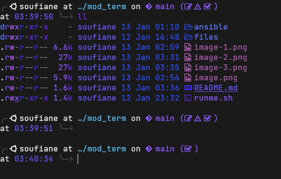

# 🚀 Mod Term - Automated Zsh Environment

Transform any standard Linux terminal into a modern, high-performance DevOps workstation. This project automates the deployment of a fully-loaded Zsh environment with **Ansible** or a simple **Bash script**.

## ✨ Key Features

- **Dynamic Prompt**: Powered by **Starship** with custom OS detection (Debian 🌀, Ubuntu, etc.)
- **Smart History**: Timestamps included and duplicates removed for better traceability
- **Productivity Aliases**:
  - **Cloud/K8s**: `k` (kubectl), `tf` (terraform), `h` (helm)
  - **Ansible**: `a` (ansible), `ap` (ansible-playbook)
  - **Visual**: `ls` & `ll` mapped to `eza`/`exa` with icons
- **Auto-Completion**: Context-aware suggestions and syntax highlighting
- **Fast Syntax Highlighting**: Real-time shell syntax validation

## 🚀 Quick Start

### Option 1: Local Installation (Easiest)

```bash
chmod +x runme.sh
./runme.sh
```

This installs everything locally:
- Zsh + Oh My Zsh
- Starship prompt
- Syntax highlighting & auto-completion plugins
- Sets Zsh as default shell

**Supported OS**: Debian/Ubuntu (apt), RHEL/CentOS (yum)

### Option 2: Ansible Deployment (Multi-host)

For deploying across multiple machines:

**Step 1: Configure your hosts**

Edit `ansible/hosts.ini` with your target machines

**Step 2: Run the setup playbook**

```bash
ansible-playbook -i ansible/hosts.ini ansible/setup_term.yml
```

Optional: Run with Sudo password prompt
```bash
ansible-playbook -i ansible/hosts.ini ansible/setup_term.yml --ask-become-pass
```

## 📋 System Requirements

- **OS**: Debian, Ubuntu, RHEL, CentOS
- **For Ansible**: Python 3.6+, Ansible 2.9+
- **Shell**: Bash (will be replaced with Zsh)
- **Terminal Emulator**: Supports Nerd Fonts (e.g., JetBrainsMono, FiraCode)

## 📂 Project Structure

```
mod_term/
├── ansible/
│   ├── hosts.ini              # Target hosts configuration
│   ├── setup_term.yml         # Main setup playbook
│   ├── start.yml              # Startup configuration
│   └── tasks_per_user.yml     # Per-user customization tasks
├── files/
│   ├── .zshrc                 # Hardened shell configuration
│   └── starship.toml          # Cross-shell prompt design
├── runme.sh                   # Local installation script
└── README.md                  # This file
```

## 🔧 Features in Detail

### Starship Configuration
- Detects Git status, Kubernetes context, Terraform workspace, language versions
- Minimal and fast with custom themes
- Works across all major shells (Bash, Zsh, Fish)

### Aliases Provided
| Alias | Command | Purpose |
|-------|---------|---------|
| `k` | kubectl | K8s operations |
| `tf` | terraform | IaC management |
| `h` | helm | Helm charts |
| `a` | ansible | Automation |
| `ap` | ansible-playbook | Run playbooks |
| `ls` | eza -la | Enhanced directory listing |
| `ll` | eza -la | Long format listing |

### Shell Plugins
- **fast-syntax-highlighting**: Real-time syntax validation as you type
- **zsh-autocomplete**: Intelligent command completion
- **zsh-autosuggestions**: Fish-like history-based suggestions

## 🛠️ Customization

### Add Custom Aliases
Edit `files/.zshrc` and add your aliases:
```bash
alias mycommand='actual command'
```

### Modify Prompt
Edit `files/starship.toml` to customize the Starship prompt appearance and modules.

### Per-User Setup (Ansible)
Use `ansible/tasks_per_user.yml` to apply user-specific configurations across multiple hosts.




## ❓ Troubleshooting

**Issue**: Nerd Font icons not displaying  
**Solution**: Set a Nerd Font in your terminal emulator settings (e.g., JetBrainsMono Nerd Font)

**Issue**: Zsh not set as default shell  
**Solution**: Run `chsh -s $(which zsh)` manually

**Issue**: Ansible permission denied  
**Solution**: Add `--ask-become-pass` flag or configure passwordless sudo

**Issue**: runme.sh permission denied  
**Solution**: `chmod +x runme.sh` then `./runme.sh`

**Issue**: Oh My Zsh plugins not loading  
**Solution**: Ensure `~/.oh-my-zsh/custom/plugins` directory exists with cloned plugins

## 📝 License

This project is open source. Feel free to fork and customize!

## 🤝 Contributing

Found an issue or have improvements? Submit a pull request or open an issue!
